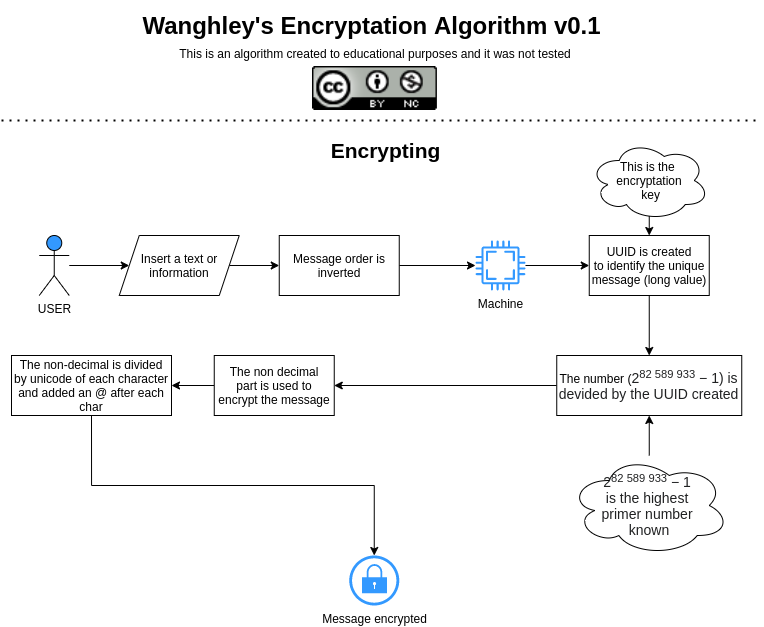
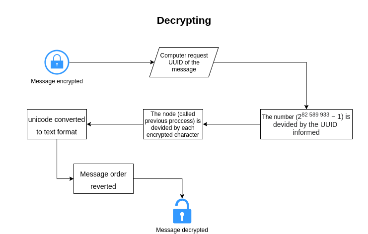

# Visualization of large amount of data for personalized medicine<br>[](https://github.com/Wanghley/PIBIC-Strategies-Data-Visualization-Medicine/) [](https://lbesson.mit-license.org/)<br>
Project of criptography model creation for educational purposes in order to test new ways of secure data as part of the process of cybersecurity. Furthermore, this repository contains a model in HTML and PNG explaining the logic of the model proposed and also a code of test made in ```python``` to exemplify the model.

## Getting Started

This is a project proposing a new method of crptography to be used based in the highest primer number known, called M82589933, which is 2^(82,589,933)-1. Based on this and some mathematical manipulations messages are encrypted.


### Model describing



Find in more details in [HTML](https://github.com/Wanghley/M82589933-Criptography/blob/master/docs/Wanghley's%20encryptation.html) file

## Running

### Prerequisites

You need to install these things to run the project

```bash
pip3 install rich
```

A step by step series of examples that tell you how to get a development env running


```
git clone https://github.com/Wanghley/M82589933-Criptography
cd https://github.com/Wanghley/M82589933-Criptography
```

And have fun running:

```
cd src/
python3 main.py
```

Then, you will be able to test and modify the project yourself.


## Contributing

Please read [CONTRIBUTING.md](https://gist.github.com/Wanghley/8d237a5e568b4e3149c0166dd010e375) for details on our code of conduct, and the process for submitting pull requests to us.

## Versioning

We use [SemVer](http://semver.org/) for versioning. For the versions available, see the [tags on this repository](https://github.com/your/project/tags). 

## Authors

* **Wanghley Soares Martins** - [wanghley](https://github.com/wanghley)

See also the list of [contributors](https://github.com/Wanghley/PIBIC-Strategies-Data-Visualization-Medicine/contributors) who participated in this project.

## License

This project is licensed under the MIT License - see the [LICENSE.md](LICENSE.md) file for details

## Acknowledgments

* This is an educational software only
* You can copy, share and modify the project
* Feel free to use the code but do not forget to reference us
